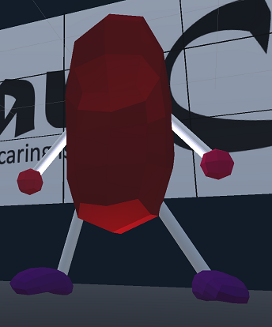

# Perspective

  

## About

Perspective is a project built for VR headsets (in this case, the Oculus Quest 1) that showcases our [original ScareCo office](https://github.com/pizzatree/ScareCo) in different viewpoints: as a Mego playset, in an ant's perspective, and even as a rotatable space.  You can rearrange the room like a doll house, scurry around - afraid to be stepped on, or even pretend that you're in *Inception* and run around in an ever rotating room!  Whatever your desire, you can experience ScareCo in a whole new way!

## Instructions and Requirements  

[Here you can view all relevant information](https://sites.google.com/view/gabe-tiemann/cs-428/projects/perspective-vr)
